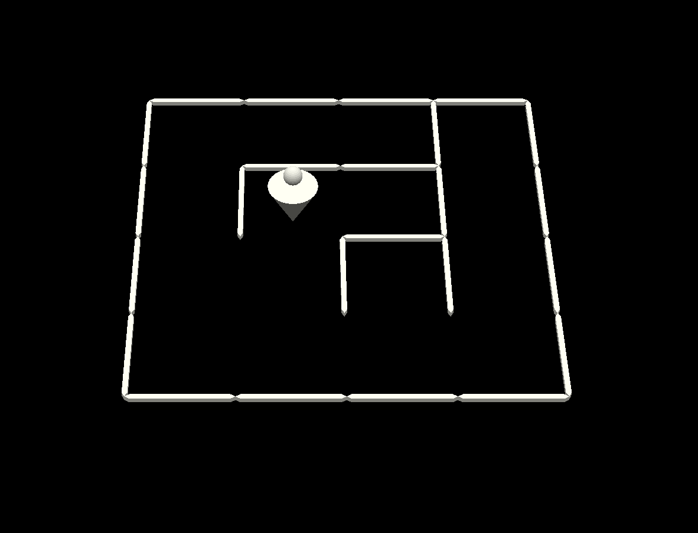

# Harmonia

Author: Russell Emerine

Design: Harmonia is a game where you control two tones with your position.
The goal is to make the tones harmonious with the background movement.

Screen Shot:

How To Play:

Move with WASD.
You'll hear that one tone becomes sharper or flatter as you move up and down,
and another tone becomes sharper or flatter as you move left and right.
There is one position that sounds harmonious with the background music.
Stand there for a few seconds and you'll move on to the next level.

Credits:

Background sounds (all my compositions) created in [BeepBox](https://www.beepbox.co)
(and re-exported through Audacity).
[MTU page](https://pages.mtu.edu/~suits/notefreqs.html) used as reference
for frequencies of notes.
Mazes partially generated with [Maze Generator](https://www.mazegenerator.net/)
(no license required for non-commercial use).

This game was built with [NEST](NEST.md).
